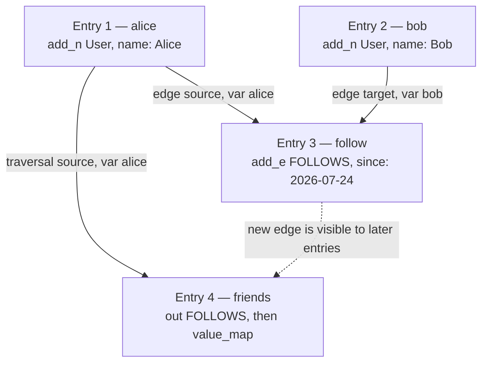
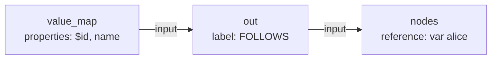

<div className="flex flex-wrap gap-2"><Badge color="green" size="sm">Tutorial</Badge></div>

[Get Started](/database/helix-db/start-here/quickstart) runs one query that creates two
users, connects them with a relationship, and reads that relationship back. This page
takes the same query apart: what each operation contributes, what it becomes on the
wire, and what the server sends back.

<Note>
  Every tab builds the same request. The JSON tab is the body sent to `POST /v2/query`,
  and the v3 SDKs are typed builders for exactly that body.
</Note>

## The whole query

<CodeGroup>

```rust Rust [expandable]
use helix_db::dsl::prelude::*;

#[query]
fn write_users() -> WriteBatch {
    write_batch()
        .var_as("alice", g().add_n("User", vec![("name", "Alice")]))
        .var_as("bob", g().add_n("User", vec![("name", "Bob")]))
        .var_as(
            "follow",
            g()
                .n(NodeRef::var("alice"))
                .add_e(
                    "FOLLOWS",
                    NodeRef::var("bob"),
                    vec![("since", "2026-07-24")],
                ),
        )
        .var_as(
            "friends",
            g()
                .n(NodeRef::var("alice"))
                .out(Some("FOLLOWS"))
                .value_map(Some(vec!["$id", "name"])),
        )
        .returning(["alice", "bob", "friends"])
}
```

```ts TypeScript [expandable]
import { NodeRef, g, writeBatch } from "@helix-db/helix-db";

const query = writeBatch()
  .varAs("alice", g().addN("User", { name: "Alice" }))
  .varAs("bob", g().addN("User", { name: "Bob" }))
  .varAs(
    "follow",
    g()
      .n(NodeRef.var("alice"))
      .addE("FOLLOWS", NodeRef.var("bob"), { since: "2026-07-24" }),
  )
  .varAs(
    "friends",
    g().n(NodeRef.var("alice")).out("FOLLOWS").valueMap(["$id", "name"]),
  )
  .returning(["alice", "bob", "friends"]);
```

```go Go [expandable]
import helix "github.com/helixdb/helix-db/sdks/go"

request := helix.WriteQuery("write_users").
	VarAs("alice", helix.G().AddN(
		"User",
		helix.Props{helix.Prop("name", "Alice")},
	)).
	VarAs("bob", helix.G().AddN(
		"User",
		helix.Props{helix.Prop("name", "Bob")},
	)).
	VarAs(
		"follow",
		helix.G().
			N(helix.NodeVar("alice")).
			AddE(
				"FOLLOWS",
				helix.NodeVar("bob"),
				helix.Props{helix.Prop("since", "2026-07-24")},
			),
	).
	VarAs(
		"friends",
		helix.G().
			N(helix.NodeVar("alice")).
			Out("FOLLOWS").
			ValueMap("$id", "name"),
	).
	Returning("alice", "bob", "friends")
```

```python Python [expandable]
from helixdb import NodeRef, g, write_batch

query = (
    write_batch()
    .var_as("alice", g().add_n("User", {"name": "Alice"}))
    .var_as("bob", g().add_n("User", {"name": "Bob"}))
    .var_as(
        "follow",
        g()
        .n(NodeRef.var("alice"))
        .add_e(
            "FOLLOWS",
            NodeRef.var("bob"),
            {"since": "2026-07-24"},
        ),
    )
    .var_as(
        "friends",
        g()
        .n(NodeRef.var("alice"))
        .out("FOLLOWS")
        .value_map(["$id", "name"]),
    )
    .returning(["alice", "bob", "friends"])
)
```

```json JSON [expandable]
{
  "request_type": "write",
  "query_name": "write_users",
  "query": {
    "write": {
      "entries": [
        {
          "query": {
            "name": "alice",
            "root": {
              "add_n": {
                "label": "User",
                "properties": [
                  ["name", { "value": { "string": "Alice" } }]
                ]
              }
            }
          }
        },
        {
          "query": {
            "name": "bob",
            "root": {
              "add_n": {
                "label": "User",
                "properties": [
                  ["name", { "value": { "string": "Bob" } }]
                ]
              }
            }
          }
        },
        {
          "query": {
            "name": "follow",
            "root": {
              "add_e": {
                "input": {
                  "nodes": { "reference": { "var": "alice" } }
                },
                "label": "FOLLOWS",
                "to": { "var": "bob" },
                "properties": [
                  ["since", { "value": { "string": "2026-07-24" } }]
                ]
              }
            }
          }
        },
        {
          "query": {
            "name": "friends",
            "root": {
              "value_map": {
                "input": {
                  "out": {
                    "input": {
                      "nodes": { "reference": { "var": "alice" } }
                    },
                    "label": "FOLLOWS"
                  }
                },
                "properties": ["$id", "name"]
              }
            }
          }
        }
      ],
      "returns": ["alice", "bob", "friends"]
    }
  }
}
```

</CodeGroup>

Four named entries run in order, and later entries reuse earlier results by name:



## 1. Pick the batch type

<CodeGroup>

```rust Rust
write_batch()
```

```ts TypeScript
writeBatch();
```

```go Go
helix.WriteQuery("write_users")
```

```python Python
write_batch()
```

```json JSON
{ "write": { "entries": [], "returns": [] } }
```

</CodeGroup>

A batch is a list of named entries plus the names to return. A write batch is the only
batch that accepts a mutating traversal. Rust and TypeScript reject `addN` in a read
batch at compile time, and Go and Python reject it while the request is being built, so
a stray write in a read path never reaches the server.

All entries in one batch commit or roll back together, which is what lets entry 4 read
the edge that entry 3 has only just created.

## 2. Create the two nodes

<CodeGroup>

```rust Rust
.var_as("alice", g().add_n("User", vec![("name", "Alice")]))
```

```ts TypeScript
.varAs("alice", g().addN("User", { name: "Alice" }))
```

```go Go
VarAs("alice", helix.G().AddN("User", helix.Props{helix.Prop("name", "Alice")}))
```

```python Python
.var_as("alice", g().add_n("User", {"name": "Alice"}))
```

```json JSON
{
  "query": {
    "name": "alice",
    "root": {
      "add_n": {
        "label": "User",
        "properties": [
          ["name", { "value": { "string": "Alice" } }]
        ]
      }
    }
  }
}
```

</CodeGroup>

`varAs` adds one entry and gives it a name. `g()` starts an empty traversal, so `addN`
here is a source operation with no `input` and creates exactly one node. Given an input
stream instead, `addN` creates one node per incoming row.

Properties travel as ordered `[name, value]` pairs, and each value carries its type tag
(`string`, `i64`, `f64`, `bool`, `date_time`, `bytes`, and the array and object
variants). The `{ "value": … }` wrapper distinguishes a literal from an `{ "expr": … }`
reference such as a [parameter](/database/helix-db/query-guides/parameters).

The name `alice` is local to this transaction. It is not a stored variable, a route, or
a server-side binding, and it is gone once the response is sent.

## 3. Connect them with a directed edge

<CodeGroup>

```rust Rust
.var_as(
    "follow",
    g()
        .n(NodeRef::var("alice"))
        .add_e("FOLLOWS", NodeRef::var("bob"), vec![("since", "2026-07-24")]),
)
```

```ts TypeScript
.varAs(
  "follow",
  g()
    .n(NodeRef.var("alice"))
    .addE("FOLLOWS", NodeRef.var("bob"), { since: "2026-07-24" }),
)
```

```go Go
VarAs(
	"follow",
	helix.G().
		N(helix.NodeVar("alice")).
		AddE(
			"FOLLOWS",
			helix.NodeVar("bob"),
			helix.Props{helix.Prop("since", "2026-07-24")},
		),
)
```

```python Python
.var_as(
    "follow",
    g()
    .n(NodeRef.var("alice"))
    .add_e("FOLLOWS", NodeRef.var("bob"), {"since": "2026-07-24"}),
)
```

```json JSON
{
  "query": {
    "name": "follow",
    "root": {
      "add_e": {
        "input": { "nodes": { "reference": { "var": "alice" } } },
        "label": "FOLLOWS",
        "to": { "var": "bob" },
        "properties": [
          ["since", { "value": { "string": "2026-07-24" } }]
        ]
      }
    }
  }
}
```

</CodeGroup>

Unlike `addN`, `addE` needs an input stream: the nodes in that stream become the edge
sources, and `to` is the target. `n(NodeRef.var("alice"))` turns entry 1's result back
into a stream, which is why `add_e` carries an `input` of
`{ "nodes": { "reference": { "var": "alice" } } }`.

Direction comes from the operation, not the label: Alice is the source and Bob is the
target, so traversing out from Alice reaches Bob. If the input stream held several
nodes, `addE` would create one edge per source node.

`since` is stored as a plain string here because the value is written as a string. Use a
date-time property when you need range comparisons or ordering on it.

<Note>
  `follow` is not listed in `returning`, so it never appears in the response. The entry
  still runs. Leave write-only steps out of `returning` to keep the payload small.
</Note>

## 4. Follow the new edge in the same transaction

<CodeGroup>

```rust Rust
.var_as(
    "friends",
    g()
        .n(NodeRef::var("alice"))
        .out(Some("FOLLOWS"))
        .value_map(Some(vec!["$id", "name"])),
)
```

```ts TypeScript
.varAs(
  "friends",
  g().n(NodeRef.var("alice")).out("FOLLOWS").valueMap(["$id", "name"]),
)
```

```go Go
VarAs(
	"friends",
	helix.G().N(helix.NodeVar("alice")).Out("FOLLOWS").ValueMap("$id", "name"),
)
```

```python Python
.var_as(
    "friends",
    g().n(NodeRef.var("alice")).out("FOLLOWS").value_map(["$id", "name"]),
)
```

```json JSON
{
  "query": {
    "name": "friends",
    "root": {
      "value_map": {
        "input": {
          "out": {
            "input": { "nodes": { "reference": { "var": "alice" } } },
            "label": "FOLLOWS"
          }
        },
        "properties": ["$id", "name"]
      }
    }
  }
}
```

</CodeGroup>

This entry is a read inside a write batch. It starts at Alice again, walks out along
`FOLLOWS`, and projects two fields from whatever it lands on. The edge from entry 3 is
uncommitted at this point but still visible, because the batch is one transaction.

Each chained operation consumes the previous stream and wraps it as `input`, so the AST
nests in the opposite order to the builder chain: the last operation you write is the
outermost JSON object, and the source sits at the innermost position.



`out` returns the destination nodes of outgoing edges. Passing a label does more than
filter the results — it narrows which edges are read in the first place, so always pass
one when the schema provides it.

| Operation | Result |
| --- | --- |
| `out(label)` | Destination nodes of outgoing edges |
| `in(label)` | Source nodes of incoming edges |
| `both(label)` | Adjacent nodes in either direction |
| `outE(label)` / `inE(label)` | The edges themselves |

`valueMap` is a terminal operation: it selects properties by name and ends the
traversal, so nothing can be chained after it. `$id` and `$label` expose identity and
label alongside ordinary properties, and omitting the property list returns every
property.

## 5. Choose what comes back

<CodeGroup>

```rust Rust
.returning(["alice", "bob", "friends"])
```

```ts TypeScript
.returning(["alice", "bob", "friends"]);
```

```go Go
Returning("alice", "bob", "friends")
```

```python Python
.returning(["alice", "bob", "friends"])
```

```json JSON
{ "returns": ["alice", "bob", "friends"] }
```

</CodeGroup>

`returning` picks which named entries appear in the response body. Names it omits still
execute; they are simply not serialized back to the client.

## 6. Name the request

<CodeGroup>

```rust Rust
let request = write_users();
```

```ts TypeScript
const request = query.toQueryRequest({ queryName: "write_users" });
```

```go Go
request := helix.WriteQuery("write_users") // named before the entries are added
```

```python Python
request = query.to_query_request(query_name="write_users")
```

```json JSON
{
  "query_name": "write_users"
}
```

</CodeGroup>

Rust's `#[query]` macro rewrites the function to return a request and sets `query_name`
from the function name. TypeScript and Python convert a batch with `toQueryRequest` /
`to_query_request`, and Go's `WriteQuery(name)` took the name up front.

`query_name` is optional diagnostic metadata for gateway logs and query diagnostics. It
does not create a stored endpoint or deploy anything; a missing or `null` name is
reported as `__dynamic__`.

## 7. Run it

{/* client-setup: no JSON representation */}
<CodeGroup>

```rust Rust
let client = helix_db::Client::new(None)?;
let response: serde_json::Value = client.query(request).send().await?;
```

```ts TypeScript
import { Client } from "@helix-db/helix-db";

const response = await Client.server("http://localhost:6969")
  .query(request)
  .send();
```

```go Go
client, err := helix.NewClient("http://localhost:6969")
if err != nil {
	return err
}
var response map[string]any
err = client.Exec(ctx, request, &response)
```

```python Python
from helixdb import Client

response = Client("http://localhost:6969").query(request)
```

```bash CLI
helix query dev --file write_users.json
```

</CodeGroup>

## 8. Read the response

The response is a flat object keyed by the names in `returning`:

```json
{
  "alice": [{ "$id": 0 }],
  "bob": [{ "$id": 1 }],
  "friends": [{ "$id": 1, "name": "Bob" }]
}
```

The shape of each value depends on how its entry ended:

| Key | Entry ended with | Shape |
| --- | --- | --- |
| `alice`, `bob` | `add_n`, a node stream | One object per node containing its `$id` |
| `friends` | `value_map`, a terminal projection | One object per row containing the selected properties |

Node and edge IDs are unsigned 64-bit integers, and projected properties come back as
plain JSON values rather than the tagged form used in the request.

Returning a raw stream is rarely what a caller wants. End an entry with the terminal that
produces the shape you need — each of these replaces `valueMap` on the `friends` entry:

| Terminal | Response |
| --- | --- |
| `valueMap(["$id", "name"])` | `[{ "$id": 1, "name": "Bob" }]` |
| `id()` | `[1]` |
| `count()` | `1` |
| `exists()` | `true` |
| `project(…)` | One object per row with named fields |

Populated values keep these existing shapes. Only a declared return with no
value uses an inferred empty shape:

| Semantic return | Populated | Empty or skipped |
| --- | --- | --- |
| At most one row, such as `limit(1)` | Existing one-element array | `null` |
| Collection, many, or unknown cardinality | Existing array | `[]` |
| `fold` or mutation | Existing array | `[]` |
| Scalar terminal, such as `count()` or `exists()` | Existing scalar | No synthetic empty value |

The planner infers this from the semantic output type and guaranteed
multiplicity. It does not use the observed row count or optimizer estimates. An
empty `returns` declaration returns `{}` because it declares no response keys.

## 9. Read it back in a later request

Once the write has committed, the same traversal works from a read batch — Alice is now
found by property instead of by a name from an earlier entry:

<CodeGroup>

```rust Rust
read_batch()
    .var_as(
        "alice",
        g()
            .n_with_label("User")
            .where_(Predicate::eq("name", "Alice"))
            .limit(1),
    )
    .var_as(
        "friends",
        g()
            .n(NodeRef::var("alice"))
            .out(Some("FOLLOWS"))
            .dedup()
            .value_map(Some(vec!["$id", "name"])),
    )
    .returning(["friends"]);
```

```ts TypeScript
readBatch()
  .varAs(
    "alice",
    g().nWithLabel("User").where(Predicate.eq("name", "Alice")).limit(1),
  )
  .varAs(
    "friends",
    g()
      .n(NodeRef.var("alice"))
      .out("FOLLOWS")
      .dedup()
      .valueMap(["$id", "name"]),
  )
  .returning(["friends"]);
```

```go Go
helix.ReadQuery("alice_friends").
	VarAs(
		"alice",
		helix.G().
			NWithLabel("User").
			Where(helix.PredEq("name", "Alice")).
			Limit(1),
	).
	VarAs(
		"friends",
		helix.G().
			N(helix.NodeVar("alice")).
			Out("FOLLOWS").
			Dedup().
			ValueMap("$id", "name"),
	).
	Returning("friends")
```

```python Python
(
    read_batch()
    .var_as(
        "alice",
        g().n_with_label("User").where(Predicate.eq("name", "Alice")).limit(1),
    )
    .var_as(
        "friends",
        g()
        .n(NodeRef.var("alice"))
        .out("FOLLOWS")
        .dedup()
        .value_map(["$id", "name"]),
    )
    .returning(["friends"])
)
```

```json JSON [expandable]
{
  "request_type": "read",
  "query_name": "alice_friends",
  "query": {
    "read": {
      "entries": [
        {
          "query": {
            "name": "alice",
            "root": {
              "limit": {
                "input": {
                  "where": {
                    "input": {
                      "nodes_where": {
                        "predicate": {
                          "eq": {
                            "left": { "property": "$label" },
                            "right": { "constant": { "string": "User" } }
                          }
                        }
                      }
                    },
                    "predicate": {
                      "eq": {
                        "left": { "property": "name" },
                        "right": { "constant": { "string": "Alice" } }
                      }
                    }
                  }
                },
                "count": { "literal": 1 }
              }
            }
          }
        },
        {
          "query": {
            "name": "friends",
            "root": {
              "value_map": {
                "input": {
                  "dedup": {
                    "input": {
                      "out": {
                        "input": {
                          "nodes": { "reference": { "var": "alice" } }
                        },
                        "label": "FOLLOWS"
                      }
                    }
                  }
                },
                "properties": ["$id", "name"]
              }
            }
          }
        }
      ],
      "returns": ["friends"]
    }
  }
}
```

</CodeGroup>

It returns the same rows the write batch already reported:

```json
{ "friends": [{ "$id": 1, "name": "Bob" }] }
```

Two details are worth noting. `nWithLabel` becomes a `nodes_where` source predicate on
`$label`, and the general `.where(…)` filter wraps it — the label chooses what is
scanned, the filter narrows the rows that come out of it. And `dedup()` guards against
the multigraph case, where several `FOLLOWS` edges between the same pair would otherwise
yield the same node more than once.

A label scan reads every `User`. Add a
[secondary index](/database/helix-db/query-guides/secondary-indexes) on `name` and use
`nWhere` instead, so the lookup is pushed down to the index.

## Next steps

<CardGroup cols={2}>
  <Card title="Writing data" icon="pen" href="/database/helix-db/query-guides/writing-data">
    Use a write batch for graph mutations.
  </Card>
  <Card title="Reading data" icon="database" href="/database/helix-db/query-guides/reading-data">
    Choose an efficient source for a traversal.
  </Card>
  <Card title="Traversals" icon="route" href="/database/helix-db/query-guides/traversals">
    Follow relationships and keep correlated values.
  </Card>
  <Card title="Add parameters" icon="sliders" href="/database/helix-db/query-guides/parameters">
    Separate runtime values from the stable AST.
  </Card>
</CardGroup>
